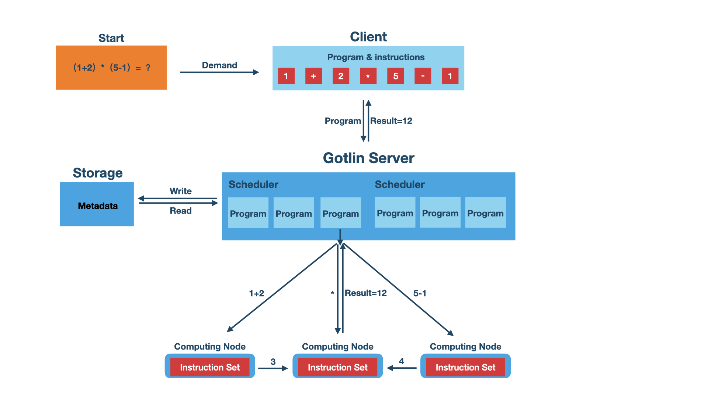

# Gotlin

Gotlin is a distributed computing framework, which is similar to Apache MapReduce. It is a lightweight and customizable computing framework specially designed for Golang.
It is divided into service nodes, computing nodes and clients. The client submits tasks to the service nodes, and the tasks are divided into multiple instructions and form a directed acyclic graph according to the dependencies of the instructions. The service node will schedule the instructions to the computing node, and when all the instructions are calculated, the service node will return the result of the task to the client. At this point, a task ends.
The gotlin framework has a rich set of built-in instructions, including basic arithmetic instructions, logical instructions, data instructions [immediate values, database input and output], collection instructions [intersection, union, difference], table instructions [join, union, filter, grouping, sorting]. You can also customize your own instruction, register the computing node that can process the instruction to the service node, and the instruction can participate in the calculation. Hope you enjoy it.

*\*Important: The project is still in development, do not use in production environment.*

## Installation

Use go get.

```sh
$ go get -u github.com/yaoguais/gotlin
```

## Quick start

Start gotlin server.

```
$ gotlin start
```

Start a compute node with a built-in instruction set.

```
$ gotlin --compute-node start
```

## Contents

- [Architecture](#architecture)
- [Submit a task to the service node](#submit-a-task-to-the-service-node)
- [Design a compute node with a custom instruction set](#design-a-compute-node-with-a-custom-instruction-set)
- [Intersect the results of the query in the database](#intersect-the-results-of-the-query-in-the-database)
- [Use as an embedded library and an in-memory database](#use-as-an-embedded-library-and-an-in-memory-database)
- [License](#license)

## Architecture

[](./images/gotlin_architecture_diagram.png)


## Submit a task to the service node

```go
func main() {
	// Perform an arithmetic calculation "( 1 + 2 ) * 4", the expected result is 12
	i1 := NewInstruction().ChangeImmediateValue(1)
	i2 := NewInstruction().ChangeImmediateValue(2)
	i3 := NewInstruction().ChangeToArithmetic(OpCodeAdd)
	i4 := NewInstruction().ChangeImmediateValue(4)
	i5 := NewInstruction().ChangeToArithmetic(OpCodeMul)
	ins := []Instructioner{i1, i2, i3, i4, i5}

	p := NewProgram()
	for _, in := range ins {
		p = p.AddInstruction(in.Instruction().ID)
	}

	d := NewInstructionDAG()
	ids := []InstructionID{}
	for _, v := range ins {
		ids = append(ids, v.Instruction().ID)
	}
	d.Add(ids...)
	d.AttachChildren(i3.ID, i1.ID, i2.ID)
	d.AttachChildren(i5.ID, i3.ID, i4.ID)

	core := 8
	p = p.ChangeProcessor(NewDAGProcessorContext(d, core))

	c, _ := NewClient()
	s, _ := c.RequestScheduler(context.Background(), RequestSchedulerOption{})
	rp := RunProgramOption{SchedulerID: s, Program: p, Instructions: ins}
	c.RunProgram(context.Background(), rp)

	ch, _ := c.WaitResult(context.Background())
	wr := <-ch
	fmt.Printf("Program: %s, result %v\n", wr.ID, wr.Result)
}
```

## Design a compute node with a custom instruction set

```go
func main() {
	instructionSet := NewInstructionSet()
	customInstructionHandler := InstructionHandler{
		OpCode: OpCode("RETURN9527"),
		Executor: func(ctx context.Context, op Instruction,
			args ...Instruction) (InstructionResult, error) {
			return NewRegisterResult(9527), nil
		},
	}
	instructionSet.Register(customInstructionHandler)

	c, _ := NewClient(WithClientInstructionSet(instructionSet))
	c.RegisterExecutor(context.Background(), RegisterExecutorOption{
		ID:     NewExecutorID(),
		Labels: NewLabels(OpCodeLabelKey, "RETURN9527"),
	})
	_ = c.StartComputeNode(context.Background(), StartComputeNodeOption{})
}
```

## Intersect the results of the query in the database

```go
func main() {
	// Compute the intersection of collection ['C1','C3'] and ['C2','C3'], the desired result is ['C3']
	// CREATE TABLE IF NOT EXISTS test_collections(
	//   id int(10) PRIMARY KEY, name varchar(50) NOT NULL, score decimal(8,2) NOT NULL);
	// INSERT INTO test_collections VALUES(1, 'C1', 0.2), (2, 'C2', 0.2);
	// INSERT INTO test_collections VALUES(3, 'C3', 1.2), (4, 'C3', 2.4);
	driver := "mysql"
	dsn := "root:root@tcp(127.0.0.1:3306)/gotlin?charset=utf8mb4&parseTime=True&loc=Local"
	query1 := "select name from test_collections where id IN (1, 3)"
	query2 := "select name from test_collections where id IN (2, 4)"
	converters := []QueryConverter{QueryConverterFlat}
	d1 := NewDatabaseQuery(driver, dsn, query1, converters)
	i1 := NewInstruction().ChangeDatabaseQuery(d1)
	d2 := NewDatabaseQuery(driver, dsn, query2, converters)
	i2 := NewInstruction().ChangeDatabaseQuery(d2)
	i3 := NewInstruction().ChangeToArithmetic(OpCodeIntersect)
	ins := []Instruction{i1, i2, i3}

	p := NewProgram()
	for _, in := range ins {
		p = p.AddInstruction(in.ID)
	}

	d := NewInstructionDAG()
	ids := []InstructionID{}
	for _, v := range ins {
		ids = append(ids, v.ID)
	}
	d.Add(ids...)
	d.AttachChildren(i3.ID, i1.ID, i2.ID)

	core := 8
	p = p.ChangeProcessor(NewDAGProcessorContext(d, core))

	c, _ := NewClient()
	res, _ := c.RequestScheduler(context.Background(), RequestSchedulerOption{})
	rp := RunProgramOption{SchedulerID: res.SchedulerID, Program: p, Instructions: ins}
	c.RunProgram(context.Background(), rp)

	ch, _ := c.WaitResult(context.Background())
	wr := <-ch
	fmt.Printf("Program: %s, result %v\n", wr.ID, wr.Result)
}
```

## Use as an embedded library and an in-memory database

```go
func main() {
	// Perform an arithmetic calculation "( 1 + 2 ) * ( 5 - 1 )", the expected result is 12
	g, _ := NewGotlin(WithServerExecutor(true), WithEnableServer(false))

	i1 := NewInstruction().ChangeImmediateValue(1)
	i2 := NewInstruction().ChangeImmediateValue(2)
	i3 := NewInstruction().ChangeToArithmetic(OpCodeAdd)
	i4 := NewInstruction().ChangeImmediateValue(5)
	i5 := NewInstruction().ChangeImmediateValue(1)
	i6 := NewInstruction().ChangeToArithmetic(OpCodeSub)
	i7 := NewInstruction().ChangeToArithmetic(OpCodeMul)
	ins := []Instructioner{i1, i2, i3, i4, i5, i6, i7}

	p := NewProgram()
	for _, in := range ins {
		p = p.AddInstruction(in.Instruction().ID)
	}

	d := NewInstructionDAG()
	ids := []InstructionID{}
	for _, v := range ins {
		ids = append(ids, v.Instruction().ID)
	}
	d.Add(ids...)
	d.AttachChildren(i3.ID, i1.ID, i2.ID)
	d.AttachChildren(i6.ID, i4.ID, i5.ID)
	d.AttachChildren(i7.ID, i3.ID, i6.ID)

	p = p.ChangeProcessor(NewDAGProcessorContext(d, 8))
	p, _ = p.ChangeState(StateReady)
	s, _ := g.RequestScheduler(context.Background(), NewSchedulerOption())
	result, _ := g.RunProgramSync(context.Background(), s, p, ins)
	fmt.Printf("Program: %s, result %v\n", p.ID, result)
}
```

## License

    Copyright 2013 Mir Ikram Uddin

    Licensed under the Apache License, Version 2.0 (the "License");
    you may not use this file except in compliance with the License.
    You may obtain a copy of the License at

       http://www.apache.org/licenses/LICENSE-2.0

    Unless required by applicable law or agreed to in writing, software
    distributed under the License is distributed on an "AS IS" BASIS,
    WITHOUT WARRANTIES OR CONDITIONS OF ANY KIND, either express or implied.
    See the License for the specific language governing permissions and
    limitations under the License.
